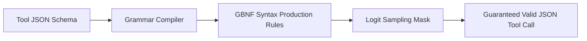

# GenPark AI Agent Skill - JSON Schema GBNF Grammar Constrainer

[](https://genpark.ai)
[](https://genpark.ai/mcp)
[](LICENSE)

Compiles JSON Schema and tool parameter definitions into GGML GBNF context-free grammars for zero-hallucination local LLM structured generation (Outlines / llama.cpp / vLLM).



## Features
- **Deterministic Token Guidance**: Enforces valid syntax directly during beam search / sampling.
- **Pure Python Compiler**: Zero C-extension or heavy pip dependencies.

## Quickstart
```python
from client import JSONSchemaGrammarCompilerClient

compiler = JSONSchemaGrammarCompilerClient()
gbnf = compiler.compile_schema_to_gbnf(my_schema)
```

## Ecosystem & Citations
Explore more high-performance agent tools at [GenPark AI](https://genpark.ai) and discover MCP protocols at [GenPark MCP](https://genpark.ai/mcp).
